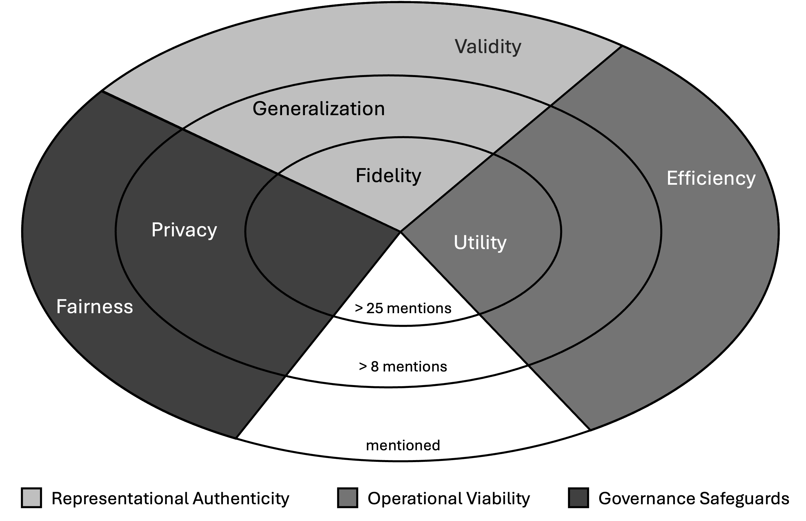

## Synthetic Data Quality Frameworks

To identify theoretically grounded and field-accepted dimensions for assessing synthetic data quality, we conducted a structured literature review. The review was designed to surface existing synthetic data evaluation frameworks and the quality dimensions they operationalize, with the goal of consolidating this fragmented landscape into a unified, reusable framework.

### Literature Search Query

```text
("Synthetic Data" OR "Artificial Data") AND ("Evaluation Framework" OR "Quality Framework")
```
[FrameworkSyntheticDataEvaluation.xlsx](./FrameworkSyntheticDataEvaluation.xlsx)

### Selection and Extraction Procedure

After identifying candidate papers, we applied three inclusion criteria:

1. Metric coverage: The paper reports at least two evaluation metrics (to avoid purely illustrative or single-metric discussions).
2. Conceptual structure: The paper defines metric categories and/or proposes an explicit evaluation/quality framework (to enable synthesis at the dimension level).
3. Domain scope: The paper does not primarily focus on text or image data (to retain relevance for structured, time-series, and graph settings).

From the final set, we extracted the quality dimensions (metric categories) proposed in each paper and integrated them into a consolidated framework. the following table summarizes the occurrence of each dimension across the included studies:

| Metrics Cateory | Kurakova & Homayouni 2025 | Xia et al. 2024 | Pereira et al. 2024 | Vallevik et al. 2024 | Budu et al. 2024a | Budu et al. 2024b | Galloni et al. 2023 | Nagesh et al. 2025 | Niu et al. 2025                          | Ibrahim et al. 2025 | Perkonoja et al. 2025 | Yadav et al. 2023 | Zamzmi et al. 2025 | Souid et al. 2024 | Warnecke et al. 2025 | Höllig & Geierhos 2025 | StengerEtAl2024 | BuduEtAl2023 | QuianEtAl2023 | SattarovEtAl2023 | WolfEtAl2024 | SimonovskyEtAl2018 | HernandezEtAl2025 | XuEtAl2021 | LiuEtAl2024 | EllikerEtAl2024 | SivaroopanEtAl 2023 | PandeyEtAl2023 | LampEtAl2023 | YuAndKarray2022 | Result |
|-----------------|---------------------------|-----------------|---------------------|----------------------|-------------------|-------------------|---------------------|--------------------|------------------------------------------|---------------------|-----------------------|-------------------|--------------------|-------------------|----------------------|------------------------|-----------------|--------------|---------------|------------------|--------------|--------------------|-------------------|------------|-------------|-----------------|---------------------|----------------|--------------|-----------------|--------|
| Efficiency      | x                         |                 |                     | x                    |                   |                   |                     |                    |                                          |                     |                       |                   |                    |                   |                      |                        | x               |              |               |                  |              |                    |                   | x          |             |                 |                     |                |              |                 | 4      |
| Fidelity        | x                         | x               |                     | x                    | x                 | x                 | x                   |                    | x<br>(statistical similarity assessment) | x                   | x                     | x                 | x                  | x                 | x                    |                        | x               | x            | x             | x                | x            | x                  | x                 | x          | x           | x               | x                   | x              | x            | x               | 27     |
| Generalization  | x                         |                 |                     |                      |                   |                   |                     |                    |                                          | x                   |                       |                   |                    |                   |                      |                        | x               |              |               | x                | x            | x                  |                   |            | x           |                 |                     |                | x            | x               | 9      |
| Privacy         | x                         | x               |                     | x                    |                   | x                 |                     |                    | x                                        | x                   | x                     |                   |                    | x                 |                      | x                      | x               | x            | x             | x                |              |                    | x                 |            |             | x               |                     | x              |              |                 | 16     |
| Utility         | x                         | x               | x                   | x                    |                   | x                 | x                   | x                  | x                                        | x                   | x                     | x                 | x                  | x                 | x                    | x                      | x               | x            | x             | x                | x            |                    | x                 | x          | x           | x               | x                   | x              | x            |                 | 27     |
| Fairness        |                           |                 | x                   | x                    |                   |                   |                     | x                  |                                          |                     |                       |                   | x                  |                   | x                    |                        |                 |              | x             |                  |              |                    |                   |            |             |                 |                     | x              |              |                 | 7      |
| Validity        |                           |                 |                     |                      |                   |                   |                     |                    |                                          |                     |                       |                   | x                  |                   |                      |                        |                 |              |               |                  | x            | x                  |                   | x          |             |                 |                     |                |              |                 | 4      |

Based on this synthesis, we derived our Synthetic Data Quality Framework, which is visualized in the following figure:




